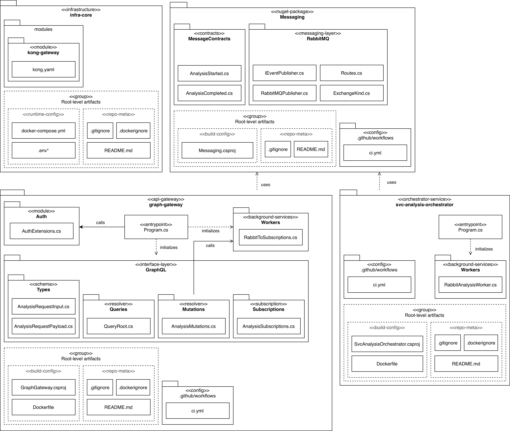

# Trackunit Project
Mobile application that uses AI to recognize construction machinery from images and provide relevant information to users.

---

## System Architecture

### Core Services

- **[GraphGateway](https://github.com/team-2-devs/graph-gateway)**  
  Microservice serving as the API facade and application gateway for the system. Provides a GraphQL API with queries, mutations, and subscriptions. Publishes `RequestAnalysis` commands to RabbitMQ and forwards `analysis/started` and `analysis/completed` events to the onAnalysisStarted and onAnalysisCompleted GraphQL subscription fields.

- **[SvcAnalysisOrchestrator](https://github.com/team-2-devs/svc-analysis-orchestrator)**  
  Microservice that orchestrates analysis. Consumes `RequestAnalysis` commands from RabbitMQ and publishes `analysis.started` and `analysis.completed` event exchanges.

### Shared Components

- **[Messaging](https://github.com/team-2-devs/messaging)**  
  NuGet package containing shared `MessageContracts` and reusable RabbitMQ publisher interfaces and implementations.

### Infrastructure

- **InfraCore**  
  Docker Compose-based orchestration environment bundling all services and infrastructure components, including **Kong Gateway**, **oauth2-proxy**, and **RabbitMQ**.

- **Kong Gateway**  
  API Gateway running in db-less mode. Routes `/graphql` requests to **oauth2-proxy**, which validates incoming tokens before forwarding them to **GraphGateway**.

- **oauth2-proxy**  
  Authentication proxy that validates Bearer tokens (JWT) issued by Microsoft Entra ID.  
  Only requests with valid tokens are forwarded to **GraphGateway**.

- **RabbitMQ**  
  Message broker for asynchronous communication.

<!-- ---

## Codebase Architecture

 -->

---
<!-- 
## System Diagram (Simplified)
```text
                     ┌──────────────────────┐
                     │     ClientConsole    │
                     │     (console app)    │
                     └────────┬─────────────┘
      HTTP/WS :8000 (GraphQL) │ ↑ 
                call mutation │ ╎ receive subscription events via WebSocket :8000
       requestAnalysis(input) ↓ ╎ (AnalysisStarted / AnalysisCompleted)
                      ┌─────────┴─────────┐
                      │   Kong Gateway    │
                      │   (API Gateway)   │
                      └───────┬───────────┘
        HTTP :4180 (internal) │ ↑ 
      foward mutation request │ ╎ forward subscription events via WebSocket :8000
       requestAnalysis(input) ↓ ╎ (AnalysisStarted / AnalysisCompleted)
                    ┌───────────┴───────────────┐
                    │       oauth2-proxy        │
                    │ (JWT validation via OIDC) │
                    └─────────┬─────────────────┘
        HTTP :8080 (internal) │ ↑ 
     receive mutation request │ ╎ publish subscription events via WebSocket :8000
       requestAnalysis(input) ↓ ╎ (AnalysisStarted / AnalysisCompleted)
                 ┌──────────────┴────────────────┐
                 │        GraphGateway           │
                 │      (GraphQL Server)         │
                 │  - handles requestAnalysis    │
                 │  - RabbitToSubscriptions      │
                 │    bridges RabbitMQ → GraphQL │
                 └─────────────┬─────────────────┘
                    AMQP :5672 │ △ 
               publish command │ ╎ receive events
             (RequestAnalysis) │ ╎ (AnalysisStarted / AnalysisCompleted)
                               ▼ ╎
         ┌───────────────────────┴────────────────────────────────────────────┐
         │                 RabbitMQ                                           │
         │  Exchanges: analysis.commands   (direct)                           │
         │             analysis.started    (fanout)                           │
         │             analysis.completed  (fanout)                           │
         │  Queues:    orchestrator.analysis.commands ← bind request.analysis │
         │             graph.subs.started             ← bind (fanout)         │
         │             graph.subs.completed           ← bind (fanout)         │
         └────────────────────┬───────────────────────────────────────────────┘
                   AMQP :5672 │ △
              receive command │ ╎ publish events
            (RequestAnalysis) │ ╎ (AnalysisStarted / AnalysisCompleted)
                              ▼ ╎
                 ┌──────────────┴───────────────┐
                 │    SvcAnalysisOrchestrator   │
                 │  - handles RequestAnalysis   │
                 │  - publishes start/completed │
                 └──────────────────────────────┘
```
>Note: Simplified for clarity. Detailed flow described below.

--- -->

## Authentication Flow

1. **Client** authenticates with **MSAL** (device code) and acquires an **access token** for the API:
   - **Scope requested:** `api://{API_CLIENT_ID}/analysis` → token `scp` includes `analysis`.
   - **Token audience:** `api://{API_CLIENT_ID}` or `{API_CLIENT_ID}`
2. **Kong** proxies `/graphql` to **oauth2-proxy**.
3. **oauth2-proxy** validates the Bearer token against Microsoft Entra ID:
   - Verifies issuer and audience
   - If valid, forwards the request upstream
4. **GraphGateway** re-validates the JWT and enforces the GraphQL authorization policy `RequireApiScope` on protected fields.

---
<!-- 
## Analysis Flow
1. **ClientConsole** opens a WebSocket to `/graphql` via Kong Gateway → oauth2-proxy → GraphGateway.  
2. **ClientConsole** starts a subscription filtered by `correlationId` or prepares to resubscribe once it has one.  
3. **ClientConsole** calls the `requestAnalysis` GraphQL mutation, passing an `objectKey`.  
4. **GraphGateway** receives the mutation, generates a `CorrelationId`, and returns it as `AnalysisRequestPayload(correlationId)` in the mutation payload.  
5. **GraphGateway** publishes a `RequestAnalysis` command to RabbitMQ (exchange: `analysis.commands`, routing key: `analysis.request`).  
6. **SvcAnalysisOrchestrator** consumes the `RequestAnalysis` command from its queue (orchestrator.analysis.commands) and simulates processing.  
7. As work progresses, the orchestrator publishes events:  
    - `AnalysisStarted` to the **analysis.started** fanout exchange.  
    - `AnalysisCompleted` to the **analysis.completed** fanout exchange.  
8. **GraphGateway** listens to those event exchanges and bridges them to GraphQL subscriptions:  
    - `AnalysisStarted` → triggers `onAnalysisStarted` subscription.  
    - `AnalysisCompleted` → triggers `onAnalysisCompleted` subscription.  
9. **ClientConsole** receives the subscription events over the existing WebSocket and filters by `correlationId` in the event payload to correlate to its request.  

--- -->

## Configuration
<!-- If values and secrets are not yet created:
1. Navigate to `infra-core/k8s`.  
2. Download `generate-secrets-and-values.sh` to that directory.  
3. Run:
   ```bash
   bash generate-secrets-and-values.sh
   ```
 -->
Add local DNS entry for graphql.local:
1. Open the hosts file:
   ```bash
   sudo vim /etc/hosts
   ```
2. Add host entry:
   ```bash
   172.21.0.4  graphql.local
   ```
   Replace `172.21.0.4` with the actual `EXTERNAL-IP` of kong-kong-proxy, available after running local Kubernetes cluster the first time.
3. Save the file.

--

## Environment Setup
<!-- **Windows:**
1. Install WSL (if you don't already have it):
   ```bash
   wsl --install -d Ubuntu
   ```
   Run all following commands inside WSL (Ubuntu). Start it by running wsl in PowerShell.
2. Install kind, kubectl, and helm:
   ```bash
   curl -Lo ./kind https://kind.sigs.k8s.io/dl/v0.30.0/kind-linux-amd64
   chmod +x ./kind
   sudo mv ./kind /usr/local/bin/kind
   ```
   ```bash
   curl -LO "https://dl.k8s.io/release/v1.30.0/bin/linux/amd64/kubectl"
   chmod +x kubectl
   sudo mv kubectl /usr/local/bin/kubectl
   ```
   ```bash
   curl -LO https://get.helm.sh/helm-v3.15.2-linux-amd64.tar.gz
   tar -xf helm-v3.15.2-linux-amd64.tar.gz
   sudo mv linux-amd64/helm /usr/local/bin/helm
   ```
3. Add kong and oauth2-proxy helm charts to helm repo:
   ```bash
   helm repo add kong https://charts.konghq.com
   ```
   ```bash
   helm repo add oauth2-proxy https://oauth2-proxy.github.io/manifests
   ```

**MacOS:** -->
1. Install Homebrew (if you don't already have it):
2. Install kind, kubectl, and helm:
   ```bash
   brew install kind
   brew install kubectl
   brew install helm
   ```
3. Add kong and oauth2-proxy helm charts to helm repo:
   ```bash
   helm repo add kong https://charts.konghq.com
   ```
   ```bash
   helm repo add oauth2-proxy https://oauth2-proxy.github.io/manifests
   ```
4. Install Go:
   ```bash
   brew install go
   ```
5. Install cloud-provider-kind:
   ```bash
   go install sigs.k8s.io/cloud-provider-kind@latest
   ```
6. Move cloud-provider-kind to /usr/local/bin for global use:
   ```bash
   sudo mv ~/go/bin/cloud-provider-kind /usr/local/bin/cloud-provider-kind
   ```

---

## Configure Tailscale & Redpanda
1. Install:
   ```bash
   curl -fsSL https://tailscale.com/install.sh | sh
   ```
2. Run:
   ```bash
   sudo tailscale up
   ```
3. Find personal tailscale IP. This is used in place of 100.106.102.107 in all configurations below.
4. Configure Redpanda:
   ```bash
   docker run -d --name=redpanda -p 9092:9092 -p 9644:9644 -v redpanda-data:/var/lib/redpanda/data docker.redpanda.com/redpandadata/redpanda:latest redpanda start --overprovisioned --smp 1 --memory 1G --kafka-addr internal://0.0.0.0:9092 --advertise-kafka-addr internal://100.106.102.107:9092
   ```
5. Enter Redpanda container:  
   <!-- Windows:
   ```bash
   docker exec -it redpanda /bin/bash
   ```
   MacOS: -->
   ```bash
   docker exec -it redpanda /bin/bash
   ```
6. Inside Redpanda container, create kafka topics:
   ```bash
   rpk topic create tu.images.uploaded --partitions 4 --replicas 1  
   rpk topic create tu.recognition.completed --partitions 4 --replicas 1  
   ```
7. Exit Redpanda container
8. Create tailscale funnel:
   ```bash
   tailscale funnel 5104
   ```
   Copy https://<address>.ts.net for later.

---

## Configure Services
**infra-core/k8s/graph-gateway/secret.yaml**  
1. Decide value in place of `changeme` and keep it consistent for all future `.env` files:
   ```yaml
   INTERNAL_AUTH_API_KEY: changeme  
   INGESTION_BASE_URL: "https://<address>.ts.net" # insert funnel address
   ```

**svc-messaging-bridge**  
1. Create `.env` at repo root:
   ```yaml
   RABBIT_HOST=localhost
   RABBIT_USER=graph
   RABBIT_PASS="<rabbit-password>" # insert rabbitmq password
   RABBIT_PORT=5672
   KAFKA_BROKERS=100.106.102.107:9092 # insert personal tailscale IP
   ```
2. Create GitHub token:  
   a. GitHub → Profile → Settings  
   b. Developer settings → Personal access token → Tokens (classic)  
   c. Generate new token → Generate new token (classic)  
   d. Give the token a name and check read:packages  
   e. Click generate and copy token  
3. Run:
   ```bash
   dotnet nuget add source "https://nuget.pkg.github.com/team-2-devs/index.json" --name "github" --username <github-username> --password <token> --store-password-in-clear-text
   ```
4. Run:
   ```bash
   dotnet restore
   ```

**tu-media-access-service**  
1. In `Dockerfile`:  
   ```yaml
   ENV ASPNETCORE_URLS=http://+:9080 # previously not defined

   EXPOSE 9080 # previously 8080
   ```
2. In `docker-compose.yml`:
   ```yaml
   ports:
   - "5136:9080" # previously 5136:8080
   ```
3. In appsettings.Development.json:
   ```yaml
   "BaseUrl": "http://localhost:9080" # previously :8080
   ```
4. Create `.env` at repo root:
   ```yaml
   INTERNAL_AUTH_API_KEY=changeme
   STORAGE_BASE_URL=http://host.docker.internal:9080 # previously :8080
   ```

**tu-storage-service**  
1. In `Dockerfile`:
   ```yaml
   ENV ASPNETCORE_URLS=http://+:9080 # previously 8080

   EXPOSE 9080 # previously 8080
   ```
2. In `docker-compose.yml`:
   ```yaml
   ports:
   - "9080:9080" # previously 8080:8080
   ```
3. Create `.env` at repo root:
   ```yaml
   MINIO_ROOT_USER=minioadmin
   MINIO_ROOT_PASSWORD=minioadmin

   INTERNAL_AUTH_API_KEY=changeme
   ```

**tu-ingestion-service**  
1. In `Dockerfile`:
   ```yaml
   ENV ASPNETCORE_URLS=http://+:9080 # previously 8080

   EXPOSE 9080 # previously 8080
   ```
2. In `docker-compose.yml`:
   ```yaml
   ports:
   - "9090:9080" # previously 8090:8080
   ```
3. In `appsettings.Development.json`:
   ```yaml
   "Messaging": {
      "Producer": "ingestion",
      "Redpanda": {
         "BootstrapServers": "100.106.102.107:9092" # insert personal tailscale IP 
   }

   "Storage": {
      "BaseUrl": "http://localhost:9080", # previously :8080
      "InternalAccess": "changeme" # previously placeholder
   }
   ```
4. Create `.env` at repo root:
   ```yaml
   REDPANDA_BOOTSTRAP_SERVERS=100.106.102.107:9092 # insert personal tailscale IP
   INTERNAL_AUTH_API_KEY=changeme
   STORAGE_BASE_URL=http://host.docker.internal:9080 # previously :8080
   ```
5. In `Ingestion.Api.csproj`, add DotNetEnv package:
   ```csharp
   <PackageReference Include="DotNetEnv" Version="3.1.1" />
   ```
6. In the beginning of `Program.cs`, add:
   ```csharp
   using DotNetEnv;

   Env.Load();
   ```
7. In repo root, run:
   ```bash
   mkdir .local/ingestion/
   ```

**svc-ai-vision-adapter**  
1. In `launchsettings.json`:
   ```yaml
   "environmentVariables": {
      "ASPNETCORE_HTTPS_PORTS": "9081", # previously 8081
      "ASPNETCORE_HTTP_PORTS": "9080" # previously 8080
   },
   ```
2. In `appsettings.json`:
   ```yaml
   "Kafka": {
      "Consumer": {
         "BootstrapServers": "100.106.102.107:9092", # insert personal tailscale IP
         "GroupId": "svc-ai-vision-adapter",
         "Topic": "tu.images.uploaded",
         "EnableAutoCommit": true
      },
      "Producer": {
         "BootstrapServers": "100.106.102.107:9092", # insert personal tailscale IP
         "Topic": "tu.recognition.completed",
         "Acks": "All",
         "MessageSendMaxRetries": 3
      }
   ```
3. In `Program.cs` (do not push this with the real X-Internal-Access value):
   ```csharp
   builder.Services.AddHttpClient<IImageUrlFetcher, HttpImageUrlFetcher>(client =>
   {
      client.BaseAddress = new Uri("http://localhost:5136");
      client.DefaultRequestHeaders.Add("X-Internal-Access", "changeme");
   });
   ```
4. In `.gitignore`:
   ```yaml
   service-account.json
   ```
<!-- 5. Windows only: Open git bash to run command below.   -->
5. Copy secret sent through https://eu.onetimesecret.com/ and insert in command below.
6. Go to `svc-ai-vision-adapter`-folder and run:
   ```bash
   echo '<secret>' \  | base64 -d > service-account.json
   ```

---

## Run Kubernetes Cluster Locally
<!-- **Windows:**
1. Ensure Docker Desktop is running.  
2. Determine the path to `infra-core/k8s`. You will need this when switching into WSL.  
3. Open PowerShell and start WASL:
   ```bash
   wsl
   ```
   All remaining commands must be executed inside the WSL terminal.  
4. Navigate to the `infra-core/k8s` directory inside WSL:
   ```bash
   cd "/mnt/<drive>/<path>/infra-core/k8s"
   ```
5. Create the Kubernetes cluster:
   ```bash
   kind create cluster --config kind-calico.yaml
   ```
6. Apply the calico CNI manifest:
   ```bash
   kubectl apply -f https://raw.githubusercontent.com/projectcalico/calico/v3.27.3/manifests/calico.yaml
   ```
7. Install required Helm charts:
   ```bash
   helm install oauth2-proxy oauth2-proxy/oauth2-proxy --namespace api-gateway --create-namespace -f helm/oauth2-proxy/values.yaml  
   helm install kong kong/kong --namespace api-gateway --create-namespace -f helm/kong/values.yaml  
   helm install rabbitmq oci://registry-1.docker.io/cloudpirates/rabbitmq --namespace messaging --create-namespace -f helm/rabbitmq/values.yaml  
   ```
8. Apply foundational manifests:
   ```bash
   kubectl apply -f helm/oauth2-proxy/secret.yaml  
   kubectl apply -f helm/rabbitmq/network-policy.yaml  
   kubectl apply -f helm/rabbitmq/nodeport.yaml  
   kubectl apply -f helm/oauth2-proxy/network-policy.yaml  
   kubectl apply -f helm/kong/network-policy.yaml  
   kubectl apply -f helm/kong/ingress-graphql.yaml
   ```
9. Create self-signed TLS certificate for graphql.local:
   ```bash
   openssl req -x509 -nodes -days 365 -newkey rsa:2048 -keyout helm/kong/kong-tls.key -out helm/kong/kong-tls.crt -config helm/kong/san.cnf -extensions req_ext
   ```
10. Create secret:
    ```bash
    kubectl create secret tls kong-ingress-tls --cert=helm/kong/kong-tls.crt --key=helm/kong/kong-tls.key -n api-gateway
    ```
11. Ensure all pods are running before proceeding:
    ```bash
    kubectl get pods -A --watch
    ```
12. Apply application manifests:
    ```bash
    kubectl apply -f graph-gateway  
    kubectl apply -f svc-analysis-orchestrator
    ```
    *If errors occur, simply run the two commands again. Sometimes manifests are applied out of order, so dependent resources may not exist the first time.*
13. Verify that all pods are running:
    ```bash
    kubectl get pods -A
    ```
14. Port-forward Kong to your local machine:
    ```bash
    kubectl port-forward -n api-gateway svc/kong-proxy 8080:80
    ```
    This makes Kong accessible at `http://localhost:8080` on your Windows machine, even though Kong is running inside the Kubernetes cluster.
15. Port-forward rabbitmq nodeport in another terminal, also at infra-core/k8s:
    ```bash
    kubectl -n messaging port-forward svc/rabbitmq-nodeport 5672:5672
    ```

**MacOS:** -->
1. Ensure Docker Desktop is running.  
2. Navigate to the `infra-core/k8s` directory.  
3. Create the Kubernetes cluster:
   ```bash
   kind create cluster --config kind-calico.yaml
   ```
4. Apply the calico CNI manifest:
   ```bash
   kubectl apply -f https://raw.githubusercontent.com/projectcalico/calico/v3.27.3/manifests/calico.yaml
   ```
5. Install required Helm charts:
   ```bash
   helm install oauth2-proxy oauth2-proxy/oauth2-proxy --namespace api-gateway --create-namespace -f helm/oauth2-proxy/values.yaml  
   helm install kong kong/kong --namespace api-gateway --create-namespace -f helm/kong/values.yaml  
   helm install rabbitmq oci://registry-1.docker.io/cloudpirates/rabbitmq --namespace messaging --create-namespace -f helm/rabbitmq/values.yaml  
   ```
6. Apply foundational manifests:
   ```bash
   kubectl apply -f helm/oauth2-proxy/secret.yaml  
   kubectl apply -f helm/rabbitmq/network-policy.yaml  
   kubectl apply -f helm/rabbitmq/nodeport.yaml  
   kubectl apply -f helm/oauth2-proxy/network-policy.yaml  
   kubectl apply -f helm/kong/network-policy.yaml  
   ```
7. Ensure all pods are running before proceeding:
   ```bash
   kubectl get pods -A --watch
   ```
8. Apply application manifests:
   ```bash
   kubectl apply -f graph-gateway  
   kubectl apply -f svc-analysis-orchestrator
   ```
   *If errors occur, simply run the two commands again. Sometimes manifests are applied out of order, so dependent resources may not exist the first time.*
9. Verify that all pods are running:
    ```bash
    kubectl get pods -A
    ```
10. Port-forward rabbitmq nodeport:
    ```bash
    kubectl -n messaging port-forward svc/rabbitmq 5672:5672
    ```
11. Open a new terminal and start cloud-provider-kind:
    ```bash
    sudo go/bin/cloud-provider-kind
    ```
    *This assigns an external IP to the Kong LoadBalancer service that allows it to be accessed from outside the Kubernetes cluster.*
12. (Optional) Open a new terminal and start tailscale funnel:
    ```bash
    tailscale funnel 5104
    ```
    *This is only required if the Kubernetes cluster needs to reach services outside Kubernetes.*

**Enforce TLS**
1. Create self-signed TLS certificate for graphql.local:
   ```bash
   openssl req -x509 -nodes -days 365 -newkey rsa:2048 -keyout helm/kong/kong-tls.key -out helm/kong/kong-tls.crt -config helm/kong/san.cnf -extensions req_ext
   ```
2. Create TLS secret for Kong:
    ```bash
    kubectl create secret tls kong-ingress-tls --cert=helm/kong/kong-tls.crt --key=helm/kong/kong-tls.key -n api-gateway
    ```
3. Upgrade Kong to enable Ingress Controller mode and TLS:
   ```bash
   helm upgrade kong kong/kong -n api-gateway -f helm/kong/values.ingress-tls.yaml
   ```
4. Apply ingress:
   ```bash
   kubectl apply -f helm/kong/ingress-graphql.yaml
   ```
5. Open `Keychain Access`.
6. Select `System` → `Certificates`.
7. Drag kong-tls.crt into the certificate list.
8. Double-click the imported certificate → expand `Trust` → set `When using this certificate` to `Always Trust`.

**Cleanup:**  
Remove the kind cluster:
```bash
kind delete cluster
```

---

## Run Services Outside Kubernetes
<!-- >Note: On Windows, all commands below should be run inside WSL. -->
**svc-ai-vision-adapter**  
1. Go to `svc-ai-vision-adapter`-folder and run:  
   <!-- Windows:
   ```bash
   $env:GOOGLE_APPLICATION_CREDENTIALS = "$PWD\service-account.json"
   dotnet run
   ```
   MacOS: -->
   ```bash
   export GOOGLE_APPLICATION_CREDENTIALS=service-account.json                                  
   dotnet run
   ```

**tu-media-access-service**  
1. At repo root, run:
   ```bash
   docker compose up -d
   ```

**tu-storage-service**  
1. At repo root, run:
   ```bash
   docker compose up -d
   ```

**minIO**  
Access:  
- URL: http://localhost:9001
- Username: `minioadmin`
- Password: `minioadmin`
Default bucket: `trackunit-images` (create it once if missing)

**tu-ingestion-service**
1. Go to `src/Ingestion.Api` and run:
   ```bash
   dotnet run
   ```

**svc-messaging-bridge**
1. At repo root, run:
   ```bash
   dotnet run
   ```

---

## Run Trackunit Client
>Does **not** support TLS.
1. Open trackunit-client in Android Studio.  
2. In the terminal, redirect to `~/Library/Android/sdk/platform-tools`.  
3. Run:
   ```bash
   ./adb reverse tcp:8080 tcp:8080
   ./adb reverse tcp:9000 tcp:9000
   ```
4. Start the app using the `Run` button.

---

## Run Console Client
>Supports TLS.
From the `client-console` repository root:
```bash
dotnet run
```
- Follow the MSAL device-code prompt.
- Use the console to request an analysis and observe live updates.

<!-- ---

## Messaging: Exchanges & Routing

- **`analysis.commands` (direct)**
  - **Routing key:** `analysis.request` (`Routes.RequestAnalysis`)
  - **Queue:** `orchestrator.analysis.commands`
  - **Publisher:** GraphGateway (mutation `RequestAnalysisAsync`)
  - **Consumer:** SvcAnalysisOrchestrator (worker `RabbitAnalysisWorker`)

- **`analysis.started` (fanout)**
  - **Publisher:** SvcAnalysisOrchestrator
  - **Consumers:** GraphGateway (bridges to GraphQL subscriptions via `RabbitToSubscriptions`, queue `graph.subs.started`)

- **`analysis.completed` (fanout)**
  - **Publisher:** SvcAnalysisOrchestrator
  - **Consumers:** GraphGateway (bridges to GraphQL subscriptions via `RabbitToSubscriptions`, queue `graph.subs.completed`) -->

---

## GraphQL Schema (SDL)

```graphql
schema {
  query: Query
  mutation: Mutation
  subscription: Subscription
}

type AIProviderDto {
  name: String!
  apiVersion: String
  featureset: [String!]!
  maxResults: Int
}

type AnalysisCompleted {
  success: Boolean!
  recognitionPayload: RecognitionCompleted
}

type AnalysisStarted {
  objectKey: String!
}

type ConfirmUploadPayload {
  status: String!
}

type ImageUploadPayload {
  uploadId: String!
  key: String!
  putUrl: String!
  expiresAt: DateTime!
}

type MachineAggregateDto {
  brand: String
  type: String
  model: String
  confidence: Float!
  isConfident: Boolean!
  typeConfidence: Float
  typeSource: String
  name: String
}

type Mutation {
  startUpload(filename: String!, contentType: String!): StartUploadPayload!
    @authorize(policy: "RequireApiScope")
    @cost(weight: "10")
  confirmUpload(
    uploadId: String!
    bytes: Int!
    checksum: String!
  ): ConfirmUploadPayload!
    @authorize(policy: "RequireApiScope")
    @cost(weight: "10")
}

type Query {
  ping: String!
}

type RecognitionCompleted {
  provider: AIProviderDto!
  aggregate: MachineAggregateDto!
}

type StartUploadPayload {
  correlationId: String!
  imageUploadPayload: ImageUploadPayload!
}

type Subscription {
  onAnalysisStarted: AnalysisStarted! @authorize(policy: "RequireApiScope")
  onAnalysisCompleted: AnalysisCompleted! @authorize(policy: "RequireApiScope")
}
```

<!-- ---

## Tech & Libraries

- **.NET 9 / C#**, **HotChocolate GraphQL**
- **RabbitMQ**
- **Kong (OSS)** in **db-less** mode
- **oauth2-proxy** for JWT validation at the edge
- **Microsoft Entra ID** via **MSAL (device code flow)** -->
<!-- - **Docker / Docker Compose** for local orchestration -->